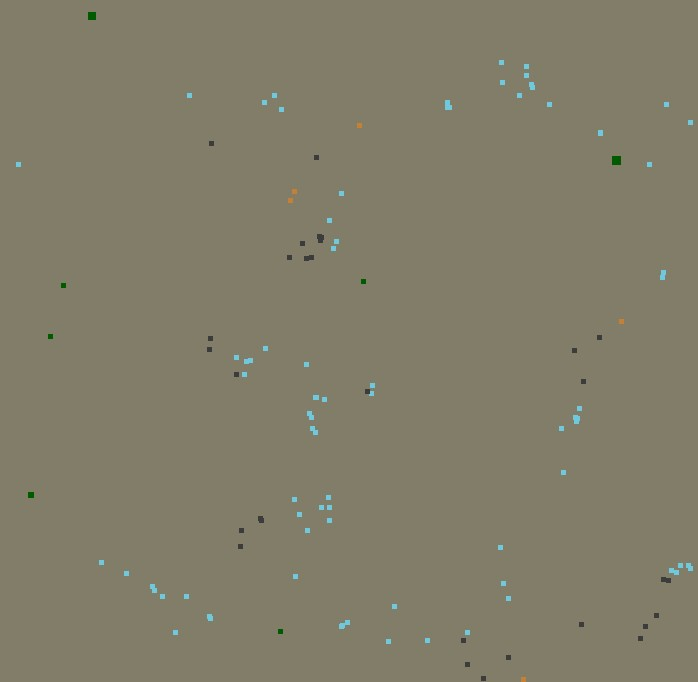
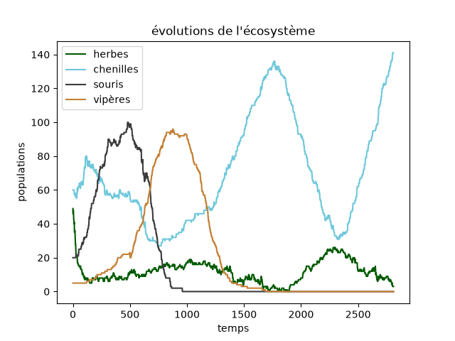

# Ecosystem

Have you ever dreamt of watching an ecosystem evolve right before your eyes ? If so, this is for you.

## Table of Contents

- [Features](#features)
- [Installation](#installation)
- [Screenshots](#screenshots)
- [License](#license)

## Features

Ecosystem enable you to run simulations of entities that can interact with one another. After the simulation, an overview of population trends is also showed.

## Installation

To run a simulation, follow these steps:

1. Download the Ecosystem version of your choice.
2. Run the python programme.
3. Enter the initial conditions of your choice.
4. Enjoy the simulation, then analyse the graph showing populations trends.

## Screenshots

## License

This software is licensed under the [MIT License](https://mit-license.org/).
